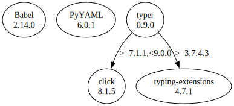

# Third Party Dependencies

<!--[[[fill sbom_sha256()]]]-->
The [SBOM in CycloneDX v1.4 JSON format](https://git.sr.ht/~sthagen/kiertotie/blob/default/sbom/cdx.json) with SHA256 checksum ([216dec74 ...](https://git.sr.ht/~sthagen/kiertotie/blob/default/sbom/cdx.json.sha256 "sha256:216dec7498ebbbc023570b2156a997b55f043155adb5a99b5ba1a8bd7855b355")).
<!--[[[end]]] (checksum: 0c7a02333c0f71668ed4d2ce31b869ea)-->
## Licenses 

JSON files with complete license info of: [direct dependencies](direct-dependency-licenses.json) | [all dependencies](all-dependency-licenses.json)

### Direct Dependencies

<!--[[[fill direct_dependencies_table()]]]-->
| Name                                       | Version                                          | License     | Author            | Description (from packaging data)                                  |
|:-------------------------------------------|:-------------------------------------------------|:------------|:------------------|:-------------------------------------------------------------------|
| [Babel](https://babel.pocoo.org/)          | [2.12.1](https://pypi.org/project/Babel/2.12.1/) | BSD License | Armin Ronacher    | Internationalization utilities                                     |
| [PyYAML](https://pyyaml.org/)              | [6.0](https://pypi.org/project/PyYAML/6.0/)      | MIT License | Kirill Simonov    | YAML parser and emitter for Python                                 |
| [typer](https://github.com/tiangolo/typer) | [0.9.0](https://pypi.org/project/typer/0.9.0/)   | MIT License | Sebastián Ramírez | Typer, build great CLIs. Easy to code. Based on Python type hints. |
<!--[[[end]]] (checksum: cccc1b5396393e789eab795c5e83b112)-->

### Indirect Dependencies

<!--[[[fill indirect_dependencies_table()]]]-->
| Name                                          | Version                                         | License     | Author        | Description (from packaging data)                 |
|:----------------------------------------------|:------------------------------------------------|:------------|:--------------|:--------------------------------------------------|
| [click](https://palletsprojects.com/p/click/) | [8.1.5](https://pypi.org/project/click/8.1.5/)  | BSD License | UNKNOWN       | Composable command line interface toolkit         |
| [pytz](http://pythonhosted.org/pytz)          | [2023.3](https://pypi.org/project/pytz/2023.3/) | MIT License | Stuart Bishop | World timezone definitions, modern and historical |
<!--[[[end]]] (checksum: 6ec29ba7b1f8907c1d018db65bc5224c)-->

## Dependency Tree(s)

JSON file with the complete package dependency tree info of: [the full dependency tree](package-dependency-tree.json)

### Rendered SVG

Base graphviz file in dot format: [Trees of the direct dependencies](package-dependency-tree.dot.txt)



### Console Representation

<!--[[[fill dependency_tree_console_text()]]]-->
````console
Babel==2.12.1
PyYAML==6.0
typer==0.9.0
├── click [required: >=7.1.1,<9.0.0, installed: 8.1.5]
└── typing-extensions [required: >=3.7.4.3, installed: 4.7.1]
````
<!--[[[end]]] (checksum: c149d54bca3150959160b78598913996)-->
